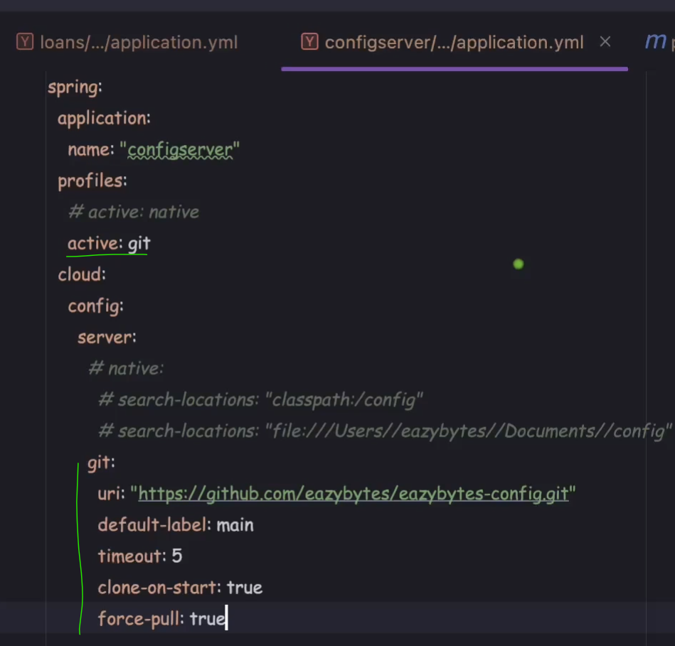
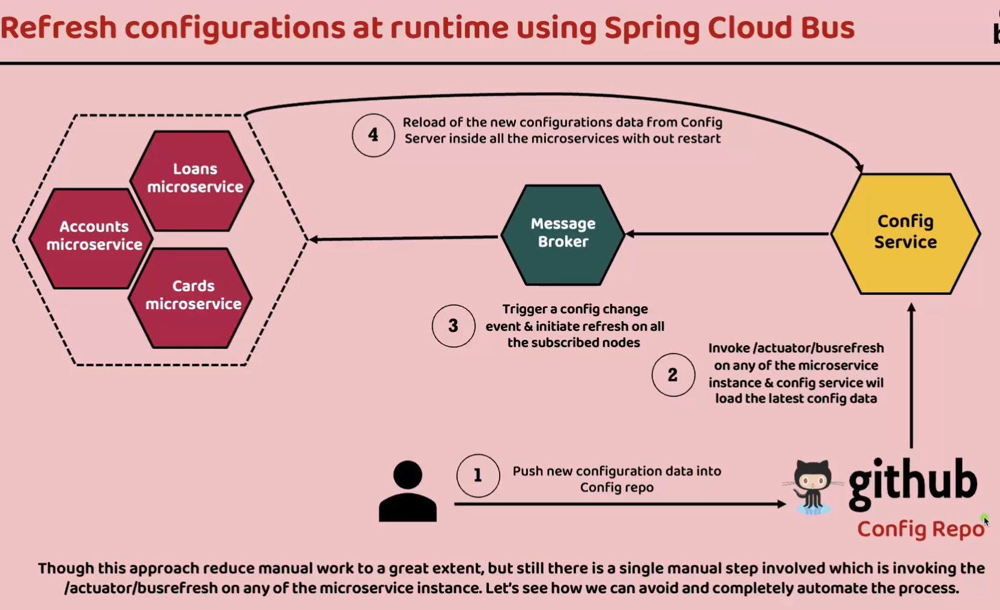

Spring Cloud Configuration
--------------------------


Best Pratices
------------
1. application name is very important use if correctly
   `spring.application.name = "configserver"`


Setting up Spring Config
------------------------
1. ### Steps to Setup Microservice
   1. **_**Pom.xml**_** - Add the spring config client depedencies as following
      1. Make sure java version is compitable with spring cloud
      ```xml
           <dependency>
               <groupId>org.springframework.cloud</groupId>
               <artifactId>spring-cloud-starter-config</artifactId>
           </dependency>
         
         <spring-cloud.version>2022.0.5</spring-cloud.version>
      
            
      <dependencyManagement>
           <dependencies>
               <dependency>
                   <groupId>org.springframework.cloud</groupId>
                   <artifactId>spring-cloud-dependencies</artifactId>
                   <version>${spring-cloud.version}</version>
                   <type>pom</type>
                   <scope>import</scope>
               </dependency>
           </dependencies>
      </dependencyManagement>
      
      
       ```
      2. Application.properties 
         3. Keep only properties that does not differ by environment
         4. Add the config client properties
         ```yaml
         server:
         port: 8080
         spring:
         application:
         name: "accounts"
         profiles:
         active: "prod"
         datasource:
         url: jdbc:h2:mem:testdb
         driverClassName: org.h2.Driver
         username: sa
         password: ''
         h2:
         console:
         enabled: true
         jpa:
         database-platform: org.hibernate.dialect.H2Dialect
         hibernate:
         ddl-auto: update
         show-sql: true
         config:
         import: "optional:configserver:http://localhost:8071/"

         ```
2. ### Setting Up Config server
   1. pom.xml
      2. Add spring config server dependency
   2. **Properties files**
      2. Move all the microservices propertie file to config folder 
         3. Name the files by microservice names
         
   4. setup properties file
      ```yaml
      spring:
      application:
      name: "configserver"
      profiles:
      active: native
      cloud:
      config:
      server:
      native:
      search-locations: "classpath:/config"

      server:
      port: 8071

      ```
   5. main Method
      6. Add @EnableConfigServer to main class
      ```java
      @SpringBootApplication
      @EnableConfigServer
      public class ConfigserverApplication {
      public static void main(String[] args) {
      SpringApplication.run(ConfigserverApplication.class, args);
      }
      }
            
     ```
3. ### Run the Services
   4. Sping up the config server
   5. Spin up the microservice
      6. Change the enviroment through cmd or vm arguments

Read config files from file system
--------------------------------


Read config files from github
----------------------------



Encryption & Decryption of properties inside Config server
----------------------------------------------------------
1. Set encrypt property in config server application properties
   
2. Make localhost:8080/encrypt and localhost:8080/dcrypt apis
   
3. add {cipher} before all encrypted properties
   


Refreshing Configurations at Runtime
----------------------------------
1. Make properties mapping bean should not be final or record
2. Disadvantages
   3. Refershing of all apis for large applicaton having hundered's of microservices instaces


Refreshing Configurations at Runtime using Spring Cloud Bus
--------------------------------------------------------
1. Only have to refresh once
   2. Even then it is manual or we need automation script




Refresh config at runtime using Spring Cloud Bus & Spring Cloud Config monitor
-----------------------------------------------------------------------------
1. Automated via github webhook
2. hookdeck site will help to map local host to public domain url that can be configured in github


Introduction to Liveness and Readiness probes
----------------------------------------

 
Writing Docker compose for Spring Cloud Bus & Spring Cloud Config monitor along with readiness
------------------------------------------------------
1. Move all repeated properties to common-config.yml 
   ```yaml
   services:
   network-deploy-service:
   networks:
   - eazybank
   
   microservice-base-config:
   extends:
   service: network-deploy-service
   deploy:
   resources:
   limits:
   memory: 700m
   environment:
   SPRING_RABBITMQ_HOST: "rabbit"
   
   microservice-configserver-config:
   extends:
   service: microservice-base-config
   environment:
   SPRING_PROFILES_ACTIVE: default
   SPRING_CONFIG_IMPORT: configserver:http://configserver:8071/
   ```
2. Make the compose file 
   3. look for depedency between the services
   4. health checks and timeouts and tries
   ```yaml
   services:
   rabbit:
   image: rabbitmq:3.13-management
   hostname: rabbitmq
   ports:
   - "5672:5672"
     - "15672:15672"
     healthcheck:
     test: rabbitmq-diagnostics check_port_connectivity
     interval: 10s
     timeout: 5s
     retries: 10
     start_period: 5s
     extends:
     file: common-config.yml
     service: network-deploy-service
   
   configserver:
   image: "eazybytes/configserver:s6"
   container_name: configserver-ms
   ports:
   - "8071:8071"
   depends_on:
   rabbit:
   condition: service_healthy
   healthcheck:
   test: "curl --fail --silent localhost:8071/actuator/health/readiness | grep UP || exit 1"
   interval: 10s
   timeout: 5s
   retries: 10
   start_period: 10s
   extends:
   file: common-config.yml
   service: microservice-base-config
   
   accounts:
   image: "eazybytes/accounts:s6"
   container_name: accounts-ms
   ports:
   - "8080:8080"
   depends_on:
   configserver:
   condition: service_healthy
   environment:
   SPRING_APPLICATION_NAME: "accounts"
   extends:
   file: common-config.yml
   service: microservice-configserver-config
   
   loans:
   image: "eazybytes/loans:s6"
   container_name: loans-ms
   ports:
   - "8090:8090"
   depends_on:
   configserver:
   condition: service_healthy
   environment:
   SPRING_APPLICATION_NAME: "loans"
   extends:
   file: common-config.yml
   service: microservice-configserver-config
   
   cards:
   image: "eazybytes/cards:s6"
   container_name: cards-ms
   ports:
   - "9000:9000"
   depends_on:
   configserver:
   condition: service_healthy
   environment:
   SPRING_APPLICATION_NAME: "cards"
   extends:
   file: common-config.yml
   service: microservice-configserver-config
   
   networks:
   eazybank:
   driver: "bridge"
```
   


